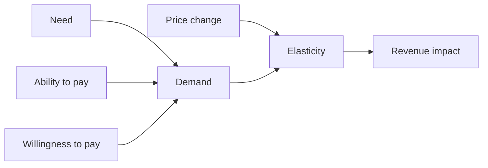
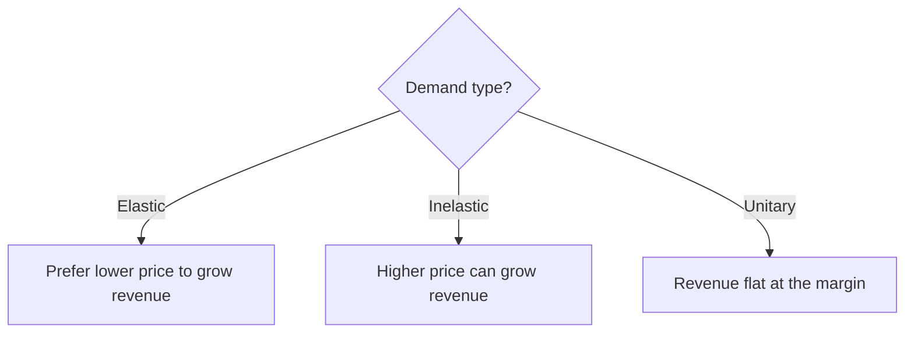

# Price Elasticity of Demand

## Intuition First

Pricing without elasticity is guessing. **Price elasticity of demand** measures how strongly quantity demanded reacts when price changes. If buyers bolt at a small hike, demand is elastic. If they barely flinch, demand is inelastic. Revenue strategy flips depending on which world you are in.

---

## Building Blocks

| Concept | Meaning |
|---------|---------|
| **Price** | Amount charged for a product or service |
| **Demand** | Need + ability + willingness to pay — all three required |
| **Elasticity** | Degree to which quantity demanded responds when price changes |

---

## The Elasticity Formula

Price elasticity of demand ($E_d$ or PED):

$E_d = \dfrac{\%\ \text{change in quantity demanded}}{\%\ \text{change in price}}$

Using relative changes:

$E_d = \dfrac{\Delta Q / Q}{\Delta P / P}$

| $|E_d|$ relative to 1 | Classification |
|-----------------------|----------------|
| $\|E_d\| > 1$ | Elastic |
| $\|E_d\| < 1$ | Inelastic |
| $\|E_d\| = 1$ | Unitary |

(Demand curves usually slope down, so $E_d$ is often discussed with absolute value.)

---

## Three Types of Demand Elasticity

### 1. Elastic Demand

Consumers are **highly sensitive** to price. A small price increase can cause a large drop in quantity demanded.

| Price move | Typical revenue effect |
|------------|------------------------|
| Increase $P$ | Total revenue falls |
| Decrease $P$ | Total revenue rises |

**Common when**: many substitutes exist (e.g. a specific brand of bottled water).

### 2. Inelastic Demand

Consumers are **less sensitive**. Quantity demanded falls only slightly even if price rises a lot.

| Price move | Typical revenue effect |
|------------|------------------------|
| Increase $P$ | Total revenue rises |
| Decrease $P$ | Total revenue falls |

**Common when**: necessities (insulin, gasoline), addictive goods (tobacco), or few/no substitutes.

### 3. Unitary Elasticity

Percentage change in price is matched by an equal percentage change in quantity demanded.

| Price move | Revenue effect |
|------------|----------------|
| Any change in $P$ | Total revenue unchanged |

Often framed as a **balance / “sweet spot”** for thinking about revenue maximisation. Example framing: petrol for commuters with a roughly fixed monthly fuel budget — spend stays relatively constant as price wiggles.

---

## Revenue Impact Summary

| Demand type | Raise price | Lower price |
|-------------|-------------|-------------|
| **Elastic** | Revenue down | Revenue up |
| **Inelastic** | Revenue up | Revenue down |
| **Unitary** | Revenue unchanged | Revenue unchanged |

### Mini Worked Numbers

Suppose $P = 100$, $Q = 50$, so revenue $R = P \times Q = 5000$.

- **Elastic case**: price $+10\%$ ($P=110$), quantity $-20\%$ ($Q=40$) → $R = 4400$ (down)
- **Inelastic case**: price $+10\%$ ($P=110$), quantity $-5\%$ ($Q=47.5$) → $R = 5225$ (up)
- **Unitary**: price $+10\%$, quantity $-10\%$ → $R$ unchanged

---

## Why This Matters for Strategy

- Elastic markets punish arrogant markups; compete on value and substitutes.
- Inelastic markets reward careful premiumisation (ethically and legally constrained for true necessities).
- Unitary thinking reminds you that not every price move “grows the top line.”

---

## Common Pitfalls / Exam Traps

- **Trap**: Saying “elastic means revenue always rises with price.” For elastic demand, raising price typically **cuts** revenue.
- **Trap**: Confusing need with inelasticity forever. Brands of a commodity can be elastic even if the category (water) is needed.
- **Trap**: Forgetting unitary: revenue flat when $\%$ΔQ$ mirrors $\%$ΔP$ in magnitude.
- **Trap**: Mixing elasticity of demand with “how much consumers like the brand.” Preference can *cause* inelasticity, but the definition is quantity response to price.
- **Trap**: Writing the formula upside down — numerator is $\%$ change in quantity, denominator $\%$ change in price.

---

## Quick Revision Summary

- $E_d = (\%\Delta Q) / (\%\Delta P)$; also $E_d = (\Delta Q/Q)/(\Delta P/P)$
- Elastic ($\|E_d\| > 1$): price up → revenue down; many substitutes
- Inelastic ($\|E_d\| < 1$): price up → revenue up; needs, addiction, few substitutes
- Unitary ($\|E_d\| = 1$): revenue unchanged with price moves
- Demand = need + ability + willingness; elasticity governs price–quantity response
- Match price moves to elasticity type before expecting revenue gains
