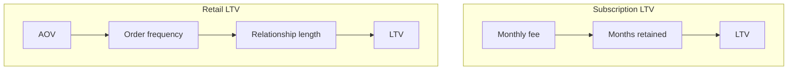

# Netflix vs Nykaa: Lifetime Value Across Business Models

## Intuition First

CLV formulas look similar until you ask **how revenue is earned**. Netflix is a **subscription** machine: fixed monthly fee, value grows mainly with months retained. Nykaa is a **transactional retail** machine: no fixed spend ceiling — value grows with basket size, order frequency, and relationship length. Same metric, different engines, different pricing and marketing priorities.

---

## Two Revenue Engines

| Dimension | Netflix (subscription) | Nykaa (transactional / retail) |
|-----------|------------------------|--------------------------------|
| **Model** | Recurring membership fee | Discretionary orders over time |
| **Spend ceiling** | Relatively fixed by plan price | No clear ceiling; baskets vary |
| **CLV core logic** | Monthly fee × months subscribed | AOV × orders per period × relationship length |
| **Predictability** | Relatively high | Wider variance across customers |

### Formulas

**Subscription (Netflix-style):**

$\text{LTV} \approx \text{Monthly subscription fee} \times \text{Number of months retained}$

**Transactional retail (Nykaa-style):**

$\text{LTV} \approx \text{Average order value (AOV)} \times \text{Orders per period} \times \text{Length of relationship}$

(Periods can be month, quarter, or year — stay consistent.)

---

## Side-by-Side: Growth, Metrics, Goals, Risks

| Lens | Netflix | Nykaa |
|------|---------|-------|
| **Revenue growth driver** | **Retention** — longer subscriptions → more revenue | **Basket size + purchase frequency** — how much and how often |
| **Primary metric** | **Churn rate** (cancels) | **Average order value (AOV)** |
| **Marketing goal** | Keep the service *essential*; build habitual watching | Create **discovery and desire**; motivate exploration and repeat shopping |
| **Key risk** | **Content fatigue** — cancel if nothing new feels worth it | **Competition / price sensitivity** — switch to Amazon (or rivals) for better deals |

---

## Pricing and Engagement Implications

| Question | Netflix implication | Nykaa implication |
|----------|---------------------|-------------------|
| Raise price? | Watch churn; need content and habit strength | Can raise effective revenue via mix, bundles, premium brands without changing “plan” |
| Discount? | Intro offers must convert to retained months | Promos may lift frequency/AOV but train deal-seeking |
| Product work that lifts LTV | More must-watch content; reduce fatigue | Merchandising, personalisation, loyalty that raise AOV and return rate |

### Tiny Numeric Sketches

**Netflix-style**: fee $= ₹650$/month, retained $14$ months → $\text{LTV} \approx 650 \times 14 = ₹9{,}100$ (gross, before costs).

**Nykaa-style**: $\text{AOV} = ₹1{,}800$, $6$ orders/year, $3$ years → $\text{LTV} \approx 1{,}800 \times 6 \times 3 = ₹32{,}400$ (gross).

Different knobs: months vs AOV × frequency × years.

---

## Analysing LTV in Practice

When evaluating LTV for any firm, always ask:

1. How does the company **generate revenue** (subscription vs transactional)?
2. What keeps customers **engaged** over time (habit/content vs discovery/desire)?
3. Which KPI is the **truth metric** (churn vs AOV/frequency)?
4. What **risk** kills the relationship (fatigue vs price switching)?

---

## Common Pitfalls / Exam Traps

- **Trap**: Applying a pure “fee × months” LTV to retail without AOV and frequency.
- **Trap**: Saying Netflix growth is mainly about raising AOV the way a retailer does — retention/churn dominate the subscription story.
- **Trap**: Treating Nykaa’s LTV as capped like a plan price — retail LTV has no single fee ceiling.
- **Trap**: Mixing brand names or industries while forgetting the model contrast (subscription vs transactional) is the teaching point.
- **Trap**: Optimising the wrong primary metric (e.g. obsessing over AOV for a pure sub business, or only churn for a pure retail pure-play).

---

## Quick Revision Summary

- Netflix: subscription LTV ≈ monthly fee × months retained; growth via retention; watch churn; risk = content fatigue
- Nykaa: retail LTV ≈ AOV × order frequency × relationship length; growth via basket + frequency; watch AOV; risk = price switching
- Marketing: Netflix → habit/essential; Nykaa → discovery and desire
- Always tie LTV math to the revenue model before recommending price moves
- Same CLV concept; different engines and KPIs
