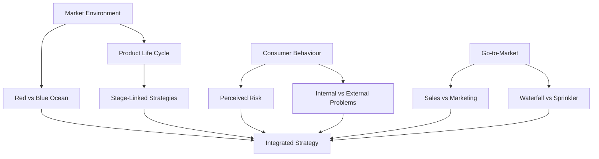

# Developing a Marketing Strategy — Module Overview

## Intuition First

Strategy is not a list of tactics. It is a thinking framework for reading the market environment, matching product stage to the right moves, reducing consumer uncertainty, and aligning sales with marketing so execution converts demand into revenue.

---

## What This Module Builds

| Capability | Focus |
|------------|-------|
| Market environment | Compete in crowded markets vs create uncontested ones |
| Product–market life cycle | How products evolve and how strategy shifts by stage |
| Perceived risk | Why buyers hesitate and how marketers reduce uncertainty |
| Sales vs marketing | Roles, handoffs, and joint outcomes |
| Sales tactics | Situational approaches across industries and contexts |

---

## Module Map

---

## Core Themes

### Market environment

- Distinguish red oceans (known, contested markets) from blue oceans (new, uncontested spaces)
- See how intensity of competition shapes profits and opportunity

### Product life cycle

- Track introduction → growth → maturity → decline
- Match pricing, promotion, and investment to each stage

### Perceived risk

- View purchases from the consumer’s uncertainty
- Model risk types and use strategy and communication to lower hesitation

### Sales and marketing alignment

- Marketing creates and nurtures demand; sales converts it
- Distinct goals and KPIs, shared business outcome

### Sales techniques

- Different rollout patterns for different market conditions
- Choice depends on consumer heterogeneity, competition, and speed needs

---

## Thinking Framework (Not Just Definitions)

| Question | Why it matters |
|----------|----------------|
| Where is the competition? | Crowded fight vs open space changes the whole plan |
| Where is the product in its life? | Stage drives price, spend, and focus |
| What fears block the buy? | Risk reduction unlocks purchase intention |
| Who owns awareness vs close? | Misaligned marketing/sales wastes pipeline |
| How fast and how wide to sell? | Sequential focus vs simultaneous scale |

---

## Real-World Thread

A D2C apparel brand launching a new category might:

1. Decide whether to fight rivals on price (red ocean) or create a new category story (blue ocean)
2. Choose introduction pricing/promotion based on awareness and competition
3. Lower perceived risk with return policies and social proof
4. Align ads that create interest with a sales process that closes
5. Roll out market-by-market or launch everywhere at once, depending on trend speed

---

## Common Pitfalls / Exam Traps

- **Trap**: Treating strategy as memorising tools. The goal is connecting environment, lifecycle, risk, and sales into one analysis.
- **Trap**: Studying red/blue ocean in isolation from lifecycle. New spaces still move through stages once competitors appear.
- **Trap**: Assuming sales and marketing are opposites. Sales sits inside the broader marketing system as conversion.
- **Trap**: Ignoring perceived risk when discussing “better features.” Features fail if uncertainty stays high.

---

## Quick Revision Summary

- Module lens: market environment + lifecycle + perceived risk + sales/marketing + sales tactics
- Red vs blue ocean: compete for existing demand vs create new demand
- PLC stages change marketing mix priorities
- Reduce consumer uncertainty to raise purchase intention
- Marketing builds demand; sales converts it
- Sales techniques must fit market conditions and priorities
- Outcome: frameworks to analyse markets and link strategy to execution
