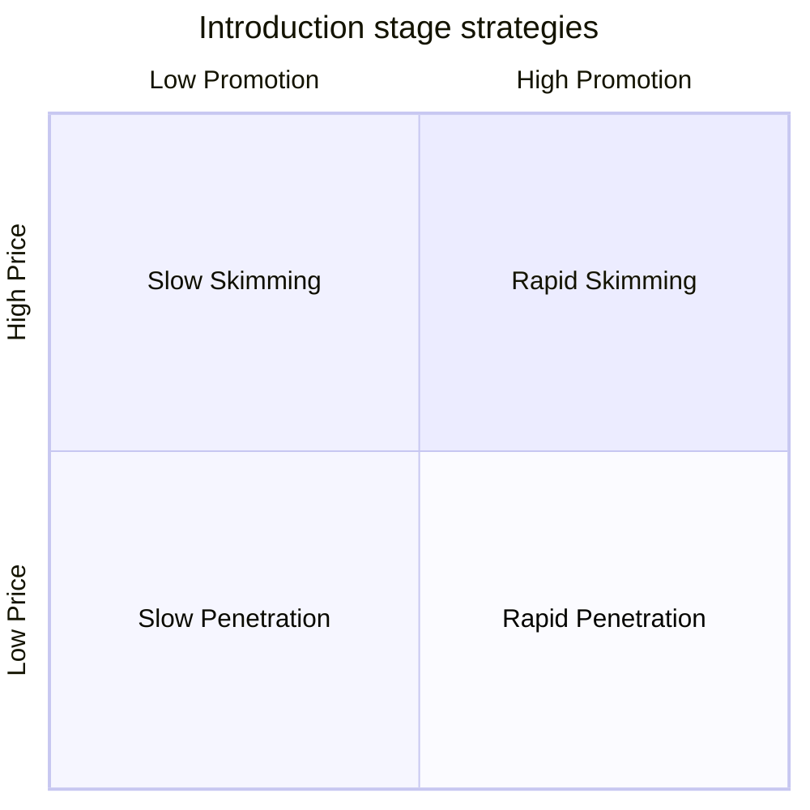

# Product Life Cycle

## Intuition First

Products do not stay “new” forever. Sales and profits follow a path — introduction, growth, maturity, decline — and the right pricing and promotion at launch can decide whether the product ever reaches a strong growth phase.

---

## Four Stages

| Stage | Sales | Profits | Marketing focus |
|-------|-------|---------|-----------------|
| **Introduction** | Low | Often negative (heavy spend) | Awareness, trial, investment recovery |
| **Growth** | Rapid rise | Rising as payoffs begin | Scale, preference, prepare for rivals |
| **Maturity** | Peak, then slow growth | Peak, then pressure | Efficiency, differentiation, defend share |
| **Decline** | Falling | Falling | Harvest, cut cost, or exit |

**Typical drivers of decline:** saturation, shifting needs, better substitutes.

---

## Introduction-Stage Pricing × Promotion Grid

At introduction, firms combine **price** (high/low) and **promotion** (high/low) into four strategies:

| Strategy | Price | Promotion | Core aim |
|----------|-------|-----------|----------|
| **Rapid skimming** | High | High | Recover investment fast + build strong awareness |
| **Slow skimming** | High | Low | Profit from early adopters with light marketing spend |
| **Rapid penetration** | Low | High | Win share quickly via fast adoption |
| **Slow penetration** | Low | Low | Gradual entry with low risk and low cost |

---

## When to Use Each Strategy

### Rapid skimming

| Condition | Application |
|-----------|-------------|
| Market awareness | Large portion still unaware |
| Buyer type | Aware buyers are early adopters willing to pay more |
| Competition | Expected soon — build brand preference quickly |
| Objective | Recover launch investment; establish brand before rivals |

**Example:** A premium new smartphone launched with heavy ads and a high launch price to early enthusiasts.

### Slow skimming

| Condition | Application |
|-----------|-------------|
| Market size | Relatively small |
| Awareness | Most potential buyers already know the product |
| Price willingness | Buyers accept a high price |
| Competition | Not imminent — no rush to overspend on promotion |
| Objective | Gradual profit with low marketing cost |

**Example:** A niche B2B instrument sold to specialists who already know the category, with limited advertising.

### Rapid penetration

| Condition | Application |
|-----------|-------------|
| Market size | Large |
| Awareness | Most consumers still unaware |
| Price sensitivity | High — low price drives trial |
| Competition | Expected to intensify — early share matters |
| Cost dynamics | Unit costs fall as scale/experience grows |
| Objective | Strong early presence; prepare for rivalry |

**Example:** A new streaming app in a price-sensitive market launching cheaply with aggressive user acquisition spend.

### Slow penetration

| Condition | Application |
|-----------|-------------|
| Market size | Large |
| Awareness | High category awareness already |
| Price sensitivity | High — low price needed |
| Promotion | Limited spend |
| Competition | Present but not requiring aggressive marketing |
| Advantage | Pioneer advantage — early enough to lock a base |
| Objective | Steady growth without heavy investment or price wars |

**Example:** A private-label grocery brand entering a known category at low price with minimal campaign spend.

---

## Later Stages (Strategic Reminder)

| Stage | Typical strategic shift |
|-------|-------------------------|
| Growth | Capitalise on adoption; differentiate as rivals arrive |
| Maturity | Defend share; improve efficiency; refresh differentiation |
| Decline | Discontinue, harvest, or cut costs as sales fall |

Strategy must match stage objectives — aggressiveness at launch is a deliberate choice, not a default.

---

## Common Pitfalls / Exam Traps

- **Trap**: Mixing up skimming and penetration. Skimming = **high** price; penetration = **low** price.
- **Trap**: Equating “rapid” only with low price. Rapid skimming is high price + **high** promotion.
- **Trap**: Using slow skimming in a large, unaware, price-sensitive market. That setup points to penetration, especially rapid.
- **Trap**: Assuming profits are high at introduction. Launch often runs negative profits due to development and marketing cost.
- **Trap**: Applying one intro strategy forever. The grid is for **introduction**; growth/maturity need different plays.

---

## Quick Revision Summary

- PLC: introduction → growth → maturity → decline
- Intro: low sales, often negative profits; decline: sales and profits fall
- Rapid skimming: high price + high promo — reclaim cost, build awareness before rivals
- Slow skimming: high price + low promo — small informed market, delayed rivalry
- Rapid penetration: low price + high promo — large unaware, price-sensitive market
- Slow penetration: low price + low promo — large aware, price-sensitive market; pioneer advantage
- Match aggressiveness to awareness, size, price sensitivity, and competitive threat
