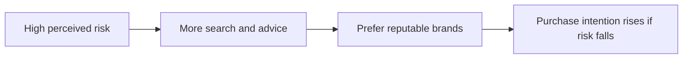
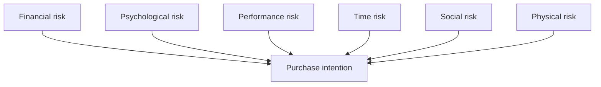

# Modelling Perceived Risk for Consumers

## Intuition First

Buyers do not only ask “Is this good?” — they ask “What could go wrong for me?” Perceived risk is the personal sense of uncertainty or possible harm after buying. Higher risk means more research, more delay, and stronger preference for trusted brands.

---

## What Is Perceived Risk?

- Consumer’s subjective uncertainty about negative outcomes from a purchase
- Tends to be higher for expensive or luxury items (cars, bags, electronics)
- Response pattern: more time, more research, advice from friends/experts, preference for established brands over unknowns

---

## Dimensions of Perceived Risk

| Dimension | Consumer fear | Effect on decision |
|-----------|---------------|--------------------|
| **Financial** | Money lost if product fails expectations | Hesitation on expensive buys |
| **Psychological** | Regret, emotional dissatisfaction | Guilt or identity conflict after purchase |
| **Performance / functional** | Product will not work as promised | Doubt about usefulness |
| **Time** | Wasted time on repair, return, replacement | Avoid complex or unreliable options |
| **Social** | Retailer reputation; others’ approval/influence | Fear of looking foolish or choosing a bad seller |
| **Physical** | Safety / bodily harm | Avoidance of untrusted physical products |

All dimensions combine to shape **purchase intention**. Lower aggregated risk → higher willingness to buy.

---

## Linking Risk to Purchase Intention

Marketers reduce uncertainty on each dimension rather than only pushing product features.

---

## Marketing Levers to Lower Risk

| Risk type | Psychological / trust lever | Communication or offer |
|-----------|----------------------------|-------------------------|
| **Functional** | Proof of performance | Case studies, demos, trials |
| **Financial** | Remove fear of loss | Refund / money-back policies |
| **Social** | Social proof | Reviews, testimonials |
| **Physical** | Safety assurance | Certifications, standards |
| **Time** | Convenience | Simple setup, quick onboarding |
| **Psychological** | Identity alignment | Mission statements, CSR, brand purpose |

Together these build trust, cut uncertainty, and raise confidence to purchase.

---

## Marketing Examples

| Product | Dominant risks | Typical risk-reduction moves |
|---------|----------------|------------------------------|
| Electric scooter | Physical, financial, performance | Safety certs, warranty, test rides |
| Online MBA course | Financial, time, psychological | Free modules, alumni stories, clear career outcomes |
| Fashion luxury bag | Social, financial | Brand heritage, authenticity guarantees, peer reviews |
| Skincare serum | Physical, performance | Clinical claims, patch tests, return window |

---

## Strategic Implications

| Insight | Action |
|---------|--------|
| Risk is perceived, not only objective | Communication can change behaviour even when specs are fixed |
| Luxury / high involvement → high risk | Expect longer journeys; design trust assets early |
| New brands start at a trust deficit | Over-invest in proof, guarantees, and social evidence |
| One lever rarely enough | Match the *dominant* risk type for the category |

---

## Common Pitfalls / Exam Traps

- **Trap**: Treating perceived risk as the same as actual product defect rates. It is the consumer’s felt uncertainty.
- **Trap**: Listing only financial risk. Exams expect multiple types (functional, social, physical, time, psychological).
- **Trap**: Confusing social risk only with “peer pressure.” It also includes retailer reputation concerns.
- **Trap**: Using CSR to fix functional risk. Match lever to risk type (performance → trials; safety → certs).
- **Trap**: Thinking low price alone removes risk. Cheap unknowns can raise performance and social risk.

---

## Quick Revision Summary

- Perceived risk = subjective uncertainty about negative purchase outcomes
- Higher for costly/luxury goods → more research and brand reliance
- Types: functional, financial, social, physical, time, psychological
- Dimensions jointly shape purchase intention
- Reduce via trials, refunds, testimonials, certifications, convenience, identity/CSR alignment
- Goal: build trust so willingness to buy rises
