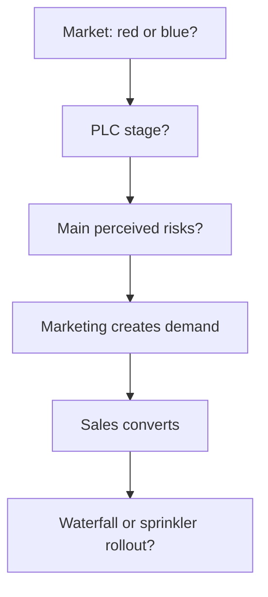

# Module Summary — Marketing Strategy Essentials

## Intuition First

Competitive strategy, product stage, consumer risk, sales–marketing roles, and rollout tactics are one toolkit. Use red vs blue ocean to read the battlefield, the product life cycle to time the mix, perceived risk to unlock buyers, sales and marketing to convert demand, and waterfall vs sprinkler to scale.

---

## Red Ocean vs Blue Ocean

| | Red ocean | Blue ocean |
|--|-----------|------------|
| Space | Saturated, existing markets | Untapped, little competition |
| Game | Battle for share | Create demand via unique value |
| Strategy focus | Outperform rivals | Innovation and new value |

Blue ocean = create demand with distinctive value. Red ocean = win where others already play.

---

## Product Life Cycle

| Stage | Strategic emphasis |
|-------|-------------------|
| **Introduction** | Skimming or penetration (price × promotion) to build awareness and/or share |
| **Growth** | Rapid adoption brings rivals; **differentiation** becomes key |
| **Maturity** | Maintain market share; efficiency and defence |
| **Decline** | Discontinuation, harvest, or cost cutting |

---

## Perceived Risk

- Uncertainty consumers feel before buying
- Types include functional, social, financial, physical, psychological (and related forms such as time risk)
- Reduce with guarantees, trials, testimonials → trust ↑ → purchase likelihood ↑

| Lever | Helps with |
|-------|------------|
| Guarantees / refunds | Financial fear |
| Trials / demos | Functional fear |
| Testimonials / reviews | Social fear |

---

## Sales vs Marketing

| Marketing | Sales |
|-----------|-------|
| Awareness, interest, positioning | Convert leads into customers |
| Generates leads | Closes deals |

They operate hand in hand: marketing fills the pipeline; sales converts it.

---

## Waterfall vs Sprinkler

| Tactic | Character | Best fit |
|--------|-----------|----------|
| **Waterfall** | Slow, controlled, sequential | Heterogeneous consumer bases |
| **Sprinkler** | Fast, aggressive, wide | Mass-market products needing rapid reach |

---

## Integrated Cheat Sheet

| Decision | Ask |
|----------|-----|
| Ocean type | Fight existing demand or create new space? |
| Stage | Intro tactics vs later defence/harvest? |
| Risk | Which uncertainty blocks the buy? |
| Org roles | Who owns awareness vs close? |
| Rollout | Sequential value tiers or simultaneous spray? |

---

## Common Pitfalls / Exam Traps

- **Trap**: Memorising oceans without linking to demand creation vs share fights.
- **Trap**: Forgetting that intro strategies are price–promotion combinations (skim vs penetrate × rapid vs slow).
- **Trap**: Treating sales as unrelated to marketing. Sales closes what marketing opens.
- **Trap**: Reversing waterfall and sprinkler (controlled sequential vs fast simultaneous).
- **Trap**: Listing risk types without reduction tactics. Exams often want both problem and response.

---

## Quick Revision Summary

- Red ocean: compete in known markets; blue ocean: create uncontested demand
- PLC: intro → growth → maturity → decline; each needs different playbooks
- Intro: skimming/penetration pricing–promotion mixes
- Perceived risk: multiple types; cut with trials, guarantees, social proof
- Marketing generates interest and leads; sales converts
- Waterfall: slow/controlled for heterogeneous markets; sprinkler: fast/wide for mass appeal
- Module goal: read markets, reduce buyer uncertainty, and apply the right sales–marketing execution
