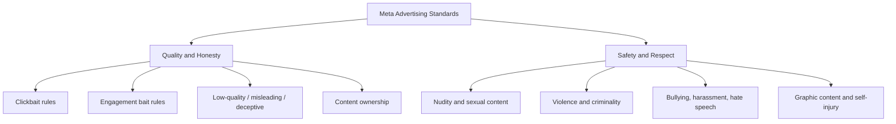

# Meta Advertising Standards and Restricted Content

## Intuition First

Meta Ads reach people inside trusted social feeds. To keep that trust, Meta enforces advertising standards: ads must be clear, safe, compliant, and honest. Cheap tricks that inflate clicks or reactions usually get disapproved — and can damage brand credibility even if they slip through once.

---

## What Meta Is (and Why Standards Matter)

| Concept | Meaning |
|---------|---------|
| **Meta ecosystem** | Platforms under Meta used for advertising (notably Facebook, Instagram, and related placements) |
| **Advertising standards** | Principles and policies that shape how ads are created, reviewed, and approved |
| **Goal of standards** | Clear, safe, compliant ads aligned with Meta policies and user trust |

**Marketing stance**: Compliance is not bureaucracy — it is a performance constraint. Disapproved ads burn time, delay launches, and waste setup cost.

---

## Two Pillars of Ad Standards

| Pillar | Covers | Marketer Takeaway |
|--------|--------|-------------------|
| **Quality and honesty** | Clickbait, engagement bait, low-quality links, misleading content, deceptive actions, content ownership | Promise must match landing experience |
| **Safety and respect** | Nudity, sexual activity, violence/criminality, bullying/harassment, hate speech, graphic content, self-injury, journalist safety guidance | Ads must stay responsible for all audiences |

---

## Engagement Bait (Discouraged)

Engagement bait manipulates people into reacting, commenting, sharing, tagging, or voting to inflate metrics. Meta AI and policy review can disapprove or remove such ads.

| Type | What It Does | Example Pattern |
|------|--------------|-----------------|
| **React bait** | Asks for specific reactions to boost visibility | “Like if yes, angry-face if no” |
| **Comment bait** | Pushes users to comment set words/phrases | “Comment YES for a surprise” |
| **Share bait** | Requires shares for contests or reach | “Share to enter / help this post go viral” |
| **Tag bait** | Pushes tagging friends for reach, often irrelevantly | “Tag a friend who needs this” |
| **Vote bait** | Fake votes via clicks/reactions/image selection | “Vote A or B to decide the winner” |

**Rule of thumb**: If the ask exists mainly to game the algorithm, it is engagement bait.

### When Engagement Asks Are Allowed

Not every call for interaction is banned. Authentic, valuable posts can ask for participation when the value is real — for example:

- Circulating a missing-child report
- Raising funds for a genuine cause
- Asking the community for useful travel tips

Meta tries to protect meaningful engagement from the same automated takedowns applied to manipulative bait.

---

## Clickbait Headlines

Clickbait attracts attention by withholding or distorting information — then damages trust.

| Don’t | Why It Fails | Do Instead |
|-------|--------------|------------|
| Withhold key information | “You’ll never believe who tripped on the red carpet” frustrates readers | State who/what clearly while staying interesting |
| Exaggerate or sensationalise | “Apples are actually bad for you” when reality is about excess | Accurate, informative, still engaging headlines |

**Brand example**: An e-commerce “flash sale” ad that says “Prices are crashing forever!” when only one SKU is discounted 10% will underperform long-term even if CTR spikes once — Meta policy and consumer trust both reject the pattern.

---

## Restricted Ad Categories (Allowed Only Under Conditions)

These categories can run only with strict compliance — local laws, age targeting, industry codes, and often prior permission or approval.

| Category | Key Conditions |
|----------|----------------|
| **Alcohol** | Local laws, industry guidelines, age restrictions; banned entirely in some countries |
| **Online dating** | Prior written permission; Meta dating guidelines + local law |
| **Real-money gambling** | Advance approval; only in permitted regions (lotteries, sports betting, skill/chance with real money) |
| **OTC / over-the-counter drugs** | Local laws, industry codes, licences/approvals; correct age and country targeting |
| **Weight loss promotions** | Target age $18+$ only; responsible targeting |
| **Cosmetic procedures / surgery** | Target age $18+$ only; comply with local ad guidelines |

**Geographic point**: Meta follows country-level law. What is allowed in one market can be blocked in another.

Official reference for deeper categories: [transparency.meta.com/policy/adstandards](https://transparency.meta.com/policy/adstandards)

---

## Marketer Checklist Before Launch

| Check | Question |
|-------|----------|
| Clarity | Does the headline reveal the real offer? |
| Landing match | Does the link deliver what the ad promised? |
| Engagement ask | Is any CTA manipulative bait or genuine value? |
| Sensitivity | Is alcohol/dating/gambling/OTC/weight/cosmetic handled with correct age, region, and permissions? |
| Ownership | Do we have rights to the creative and claims? |

---

## Common Pitfalls / Exam Traps

- **Trap**: Treating all “engagement CTAs” as illegal. Meta discourages *bait*; authentic cause/community asks can be acceptable.
- **Trap**: Confusing prohibited content (often blocked) with restricted content (allowed under conditions). Alcohol and gambling are classic restricted cases.
- **Trap**: Assuming global alcohol or gambling rules. Compliance is geography-specific.
- **Trap**: Using sensational headlines as a growth hack. Clickbait violates standards and erodes credibility even when it raises short-term CTR.
- **Trap**: Ignoring age floors for weight-loss and cosmetic ads ($18+$ targeting is required in the standards covered here).

---

## Quick Revision Summary

- Meta standards keep ads clear, safe, compliant, and trustworthy
- Two pillars: quality/honesty and safety/respect
- Engagement bait types: react, comment, share, tag, vote — discouraged because they manipulate metrics
- Authentic engagement for real value (causes, missing persons, helpful tips) can be exceptions
- Clickbait = withhold or exaggerate; prefer clear, accurate, engaging headlines
- Restricted categories: alcohol, dating, real-money gambling, OTC drugs, weight loss, cosmetic procedures — permissions, laws, and age/geo rules apply
- Policy deep-dive: Meta Ad Standards transparency page
