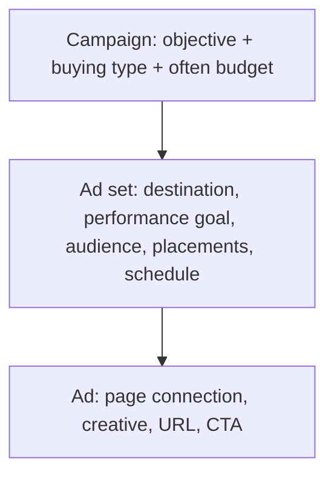
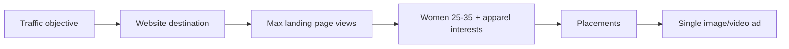
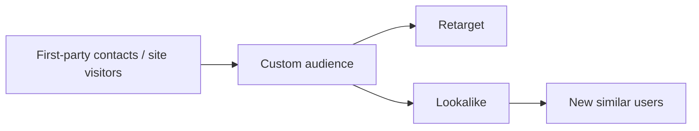

# Meta Ads Manager Lab: Building and Reading a Campaign

## Intuition First

Ads Manager is where structure becomes operational: you pick auction vs reservation, set an objective, define budget, target an audience, attach creative, then read metrics that separate vanity volume from real reach. The interface walks the same three layers every time — campaign, ad set, ad — so fluency is pattern recognition, not button memorisation.

---

## Ads Manager Entry

| Step | Action |
|------|--------|
| 1 | Open Meta Ads / Business tools and sign in with Facebook or Instagram account |
| 2 | Go to **Ads Manager** |
| 3 | Work from Campaigns view to create, pause, or inspect delivery |

Prerequisite for fuller features: Instagram business presence and/or Meta business page connection unlocks more options.

---

## Structure Recap Inside the Tool

| Layer | In-Product Focus |
|-------|------------------|
| Campaign | Objective (traffic, engagement, leads, app, awareness…); buying type |
| Ad set | Audience and placement “magic”; dates; performance goal |
| Ad | What users see — single image/video, carousel, etc. |

---

## Lab Path: Create a Traffic Campaign (Auction)

### 1. Buying Type

| Type | How It Works | Cost Character |
|------|--------------|----------------|
| **Auction** | Real-time auction for inventory | Usually more cost-effective / flexible |
| **Reservation** | Pre-set / reserved delivery for a period | Typically more expensive |

**Lab default**: Auction for learning and flexible spend.

### 2. Objective → Manual Setup

Example path: choose **Traffic** (website or Instagram profile visits) → continue → choose **manual** targeting for learning (vs letting AI fully decide) → name the campaign (e.g., `test campaign`).

### 3. Budget

| Setting | Meaning | Example |
|---------|---------|---------|
| Budget location | Campaign budget vs ad-set budget | Campaign budget for simplicity |
| **Daily budget** | Cap spend per day | ₹100 / day |
| **Lifetime budget** | Total for the flight | ₹10,000 over 7 days |

With daily budget, a start date is enough; you can stop or edit later.

### 4. Special Ad Categories (Disclaimer)

Declare if the ad falls under sensitive regulated themes such as:

- Financial products or services
- Employment
- Housing
- Social issues

Also mark securities/investment-related ads when applicable. Incorrect omission can cause rejection or restricted delivery.

---

## Ad Set Configuration

| Control | Lab Guidance |
|---------|--------------|
| Destination | Website, Instagram, Facebook page, etc. |
| Performance goal | e.g., maximise landing-page views for Traffic |
| Attribution | Start with Meta’s standard model; deeper attribution studied later |
| Schedule | Start/end based on budget type |
| Placements | Uncheck surfaces you do not want (e.g., Facebook right column) or leave automated |
| Audience | Advantage+/audience controls: age, gender, detailed interests |

**Audience example (women’s apparel)**:

| Control | Example Setting |
|---------|-----------------|
| Gender | Women |
| Age | 25–35 |
| Detailed targeting | Women’s clothing, online shopping |

---

## Ad Creative Setup

1. Connect Facebook Page and Instagram account (create page if needed)
2. Choose format (lab often uses **single image or video**)
3. Enter destination URL (e.g., `www.abc.com`) — WhatsApp links can also be used as destinations where supported
4. Upload creative or pull suggestions from existing posts
5. Preview → publish (set region/timezone as prompted)

**Operational note**: You can leave campaigns **off** with the toggle after drafting; turn on when ready to spend.

---

## Reading Performance Columns

Customise columns to show metrics that match the objective (e.g., clicks, CTR).

### Reach vs Impressions vs Frequency

| Metric | Definition | Uniqueness |
|--------|------------|------------|
| **Reach** | Number of unique people who saw the ad | Unique |
| **Impressions** | Total times the ad was shown | Non-unique (repeats count) |
| **Frequency** | Average times each reached person saw the ad | Derived |

Relationship:

$$\text{Impressions} \approx \text{Reach} \times \text{Frequency}$$

**Example**: Reach = 100, frequency = 2 → impressions ≈ 200 (each person saw the ad about twice).

| Metric | Exam One-Liner |
|--------|----------------|
| Reach | Unique people |
| Impressions | Total views (can include repeats) |
| Frequency | Average views per reached person |
| CTR | Click-through rate (clicks relative to impressions/views as defined in the column) |

---

## Ads Reporting

Build dashboards by campaign / ad set / ad with breakdowns (age, gender, region, etc.) to compare which flights and segments perform.

**Use case**: Five campaigns live → report shows which campaign and which age band drive the best results for optimisation.

---

## Audiences Hub: Three Practical Types

| Audience Type | What It Is | Marketing Use |
|---------------|------------|---------------|
| **Custom audiences** | Upload or sync your people (contacts purchased/collected, website traffic, app users) | Retarget known users; warm pools |
| **Lookalike audiences** | Meta finds people similar to a seed (custom) audience based on Meta/Instagram behaviour patterns | Prospecting: “new people who resemble buyers” |
| **Saved audiences** | Reusable targeting definitions | Speed and consistency across campaigns |

**Custom audience examples**:

- Contact lists from partners or CRM (phone/email)
- Cafe owners uploading loyalty signup emails/phones
- Website or app visitors via pixel/SDK sources (as available)

**Lookalike intuition**: If your seed customers watch cat videos and buy pet products, Meta expands toward users with similar behavioural fingerprints — not random mass reach.

---

## Account Admin Surfaces

| Area | Purpose |
|------|---------|
| **Advertiser / access settings** | Control who can use the dashboard |
| **Billing and payments** | Wallet top-ups; Paytm, Visa/Mastercard, debit/credit |

---

## End-to-End Lab Checklist

| Stage | Done When |
|-------|-----------|
| Buying type | Auction selected |
| Objective | Matches business goal (e.g., Traffic) |
| Budget | Daily or lifetime set and sustainable |
| Special categories | Declared if applicable |
| Ad set | Destination, goal, audience, placements set |
| Ad | Page connected, creative + URL ready |
| Safety | Campaign toggled intentionally on/off |
| Measurement | Reach, impressions, frequency, CTR understood |

---

## Common Pitfalls / Exam Traps

- **Trap**: Confusing reach and impressions. Reach is unique people; impressions count repeats.
- **Trap**: Forgetting $\text{Impressions} \approx \text{Reach} \times \text{Frequency}$.
- **Trap**: Choosing Reservation by default for small tests — Auction is usually the flexible, lower-friction learning mode.
- **Trap**: Omitting special ad category declarations for finance/housing/employment/social issues.
- **Trap**: Treating lookalikes as uploads of your customers. Lookalikes are *similar new people*, not the list itself.
- **Trap**: Optimising columns for vanity (impressions only) when the objective was landing-page views or leads.

---

## Quick Revision Summary

- Ads Manager: Campaign → Ad set → Ad
- Auction = real-time, typically cost-flexible; Reservation = booked, usually costlier
- Budget: daily vs lifetime; campaign- or ad-set-level
- Special categories need disclosure (finance, employment, housing, social issues, etc.)
- Ad set: destination, performance goal, audience, placements — “where magic happens”
- Metrics: reach (unique), impressions (total), frequency (repeats); customise columns for clicks/CTR
- Audiences: custom (your data), lookalike (similar prospects), saved (reusable)
- Billing and access control complete basic account operations
