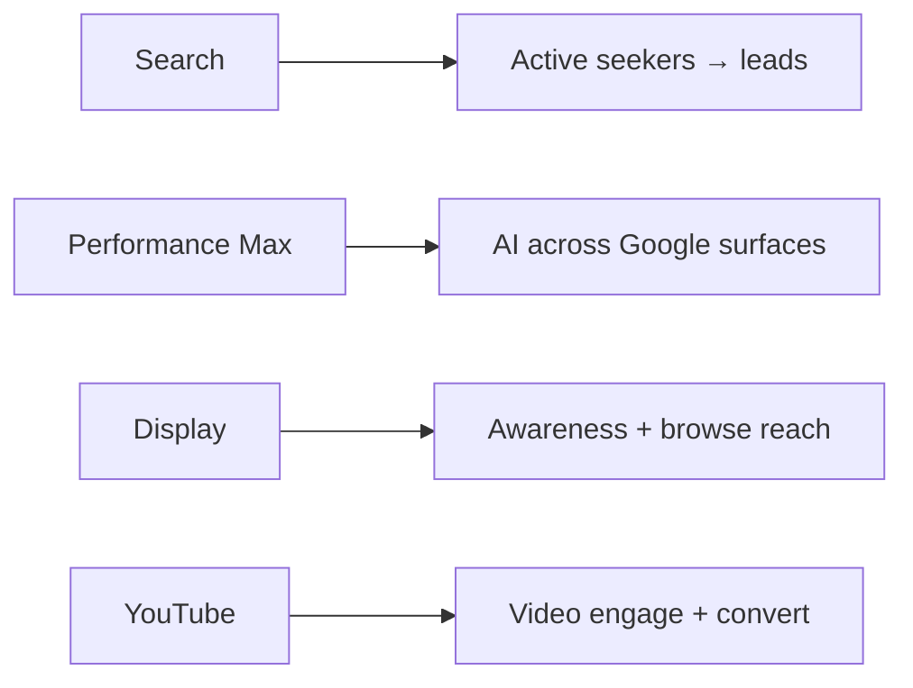
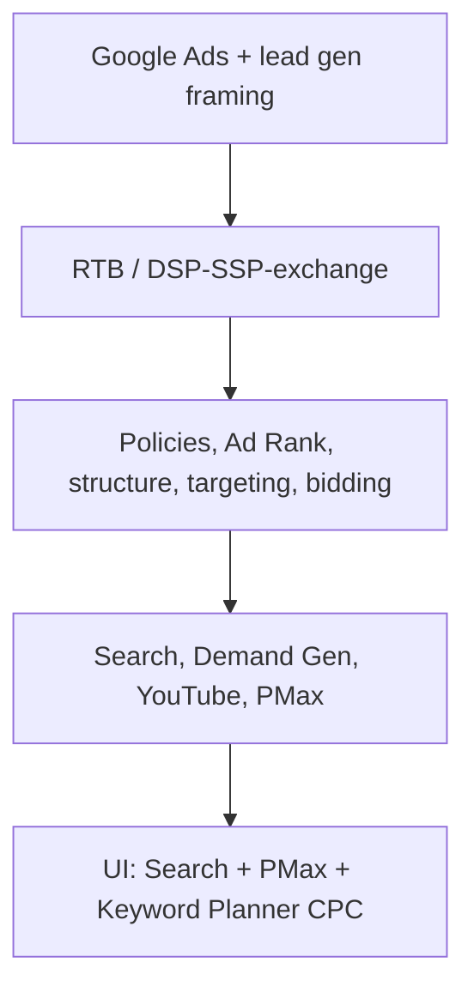

# Week Summary: Google Ads for Lead Generation

## Intuition First

This week's thread: use Google Ads as **performance marketing for lead-gen** — pick the campaign type that matches intent, layer extensions and formats for engagement, and lean on AI (especially Performance Max) where cross-channel conversion is the goal. Search captures demand; Display and YouTube expand it; PMax stitches Google's inventory together.

---

## Core Focus Recap

| Theme | Takeaway |
|-------|----------|
| Audience | Lead-generation businesses needing high-quality leads |
| Ecosystem | Multiple campaign types for different marketing goals |
| Success metric | Quality leads and conversions, not empty reach |

---

## Campaign Types Reviewed

| Type | Role |
|------|------|
| **Search** | Users actively searching related products/services → highly relevant traffic and easier lead conversion |
| **Performance Max (PMax)** | Google AI / ML across YouTube, Search, Display, Gmail, Maps — maximise conversions with less manual work |
| **Display** | Brand awareness and wider reach on sites/apps across Google Network while people browse |
| **YouTube** | Video for engagement and conversion; formats include skippable and non-skippable (and related variants covered earlier) |

---

## Search + Extensions

Search drives **intent-matched** traffic. Ad extensions improve visibility and engagement:

| Extension examples | Why they help |
|--------------------|---------------|
| Sitelinks | More paths into the site |
| Ratings | Trust / social proof |
| Callouts | Extra value props without long headlines |

---

## Performance Max in One Line

One campaign, full Google inventory, AI-optimised for conversions — ideal when the business wants **maximum conversions with minimal channel-by-channel management**.

---

## Display and YouTube Positioning

| Channel | Strength |
|---------|----------|
| **Display** | Awareness and reach while browsing; connect with prospects before/without a search |
| **YouTube** | Storytelling, engagement, timed reach with format choice (skippable vs non-skippable, etc.) |

---

## How the Pieces Fit (Week Arc)

---

## Common Pitfalls / Exam Traps

- **Trap**: Treating all four (Search / PMax / Display / YouTube) as interchangeable — each matches a different intent and control level.
- **Trap**: Claiming Search is mainly for awareness; week framing stresses **relevant traffic → leads**.
- **Trap**: Forgetting that PMax spans **YouTube + Search + Display + Gmail + Maps**, not one channel.
- **Trap**: Ignoring extensions on Search — they are part of visibility and engagement, not "optional decoration."
- **Trap**: Measuring only impressions on Display/YouTube when the business goal is lead gen — still tie back to lead quality where possible.

---

## Quick Revision Summary

- Week focus: Google Ads fundamentals for **lead-gen** performance
- **Search**: active intent + extensions (sitelinks, ratings, callouts)
- **PMax**: AI across major Google properties; max conversions, less manual work
- **Display**: awareness and browse-time reach on the Google Network
- **YouTube**: video formats (skippable, non-skippable, etc.) for engage + convert
- Choose type by goal; convert relevant traffic into high-quality leads
