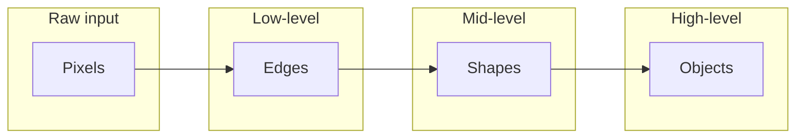

# Current Limitations & Motivation for Deeper Models – Artificial Neural Networks (Module 1)

## Learning Objectives

By the end of this video you will:

1. **Identify** the key limitations of shallow neural networks.
2. **Understand** why depth increases the expressive power of neural networks.
3. **Explain** the role of hierarchies and representation learning.
4. **Recognize** why deep models are needed for complex real-world tasks.

---

## Why Study Limitations?

So far in this module we have seen how neural networks are structured and where they are used. At this point it is important to pause and ask a critical question: **If neural networks are so powerful, what are their limitations?**

Understanding limitations is **just as important** as understanding their strengths. It helps us to:

- **Know where simple models fail** — so we can choose the right model for the problem.
- **Avoid unrealistic expectations** — so we do not overestimate what shallow networks can do.
- **Appreciate why deeper models are needed** — so we understand the motivation behind modern deep learning.

In this video we focus on the **conceptual limitations of shallow neural networks** and how those limitations **naturally motivate deeper models**. We do not yet deal with training or optimization; the focus is on *what* shallow nets cannot represent well and *why* depth helps.

---

## First Limitation: Limited Representational Power

### Definition

A **shallow network** (one with very few layers) can only perform a **small number of transformations** on the input. Each layer applies one stage of transformation; with few layers, the total number of transformations is limited.

### Consequences

As a result, shallow networks **struggle** to capture:

| Challenge | What it means |
|-----------|----------------|
| **Complex non-linear relationships** | Real-world mappings are often highly curved and interactive; shallow nets have limited capacity to approximate them. |
| **Interactions between many variables** | When many inputs jointly determine the output, multiple stages of composition are needed; shallow nets have too few stages. |
| **Subtle variations in the data** | Fine-grained patterns and exceptions require richer internal representations than a few layers can provide. |

### Real-World Demand

Many real-world problems—**vision**, **speech**, and **language**—require **multiple stages of transformation** to go from **raw input** to **meaningful abstraction**. For example:

- **Vision:** Raw pixels → local edges → textures → parts → objects.
- **Speech:** Waveform → phonemes → syllables → words → sentences.
- **Language:** Characters → words → phrases → meaning.

Shallow networks simply **do not have enough depth** to model these rich transformations effectively.

### Takeaway

Shallow networks **may work for simple patterns**, but their **capacity is fundamentally limited** for complex real-world data.

> **Exam tip:** Link “shallow” to “few transformations” and “limited capacity.” For vision, speech, or language, multiple stages of transformation are needed; shallow nets lack the depth for that.

---

## Second Limitation: Feature Engineering Bottleneck

### Definition

Earlier machine learning systems—and even shallow neural networks—depended heavily on **human-designed features**. The model learned from **hand-engineered** inputs rather than from raw data.

### When It Hurts

When data is **very high dimensional** and **useful features are deeply hidden** in raw inputs (e.g. pixels, waveform samples, or character sequences), the performance of the system becomes limited **not by its learning ability**, but by the **quality of manually engineered features**. If humans cannot design good features, the model cannot do better.

### Scaling Issue

This dependence on **human intuition and domain expertise**:

- **Does not scale well** — experts cannot design and maintain thousands of good features for every domain.
- **Often fails** in highly complex problems such as **images**, **speech**, and **natural language**, where the right features are hard to specify by hand.

### Role in History

This bottleneck is **one of the key reasons why deeper models became necessary**. Deep networks can learn useful internal representations from raw or minimally processed data, reducing the need for manual feature design.

> **Exam tip:** Contrast **hand-engineered features** (human-designed, shallow-era) with **learned representations** (automatically discovered by deep networks). The feature engineering bottleneck is why we need representation learning.

---

## Third Limitation: Inability to Capture Hierarchical Structure

### Main Idea

Most **real-world data is hierarchical in nature**. Shallow networks tend to treat data in a **flat** manner: they lack the **layered structure** required to build **hierarchies of abstraction**. As a result, they often **fail to learn the deeper structure** that underlies complex data.

### Concrete Examples from the Video

| Domain | Hierarchy (low-level → high-level) |
|--------|-------------------------------------|
| **Images** | Pixels → edges → shapes → objects |
| **Language** | Characters → words → phrases → meaning |
| **User behavior** | Simple actions → complex patterns of intent |

In each case, **low-level building blocks** combine into **progressively more abstract** concepts. Capturing this requires a **layered** model that can represent each level of the hierarchy.

### Why Shallow Nets Fail Here

Shallow networks do not have enough **layers** to mirror these natural hierarchies. They cannot naturally build “edges from pixels,” then “shapes from edges,” then “objects from shapes” in separate stages. They lack the **layered structure** required to build these **abstraction hierarchies**.

> **Exam tip:** Be able to give at least one hierarchy example (e.g. images: pixels → edges → shapes → objects; or language: characters → words → phrases → meaning). Explain that shallow nets treat data in a flat way and lack layered structure for these hierarchies.

---

## Motivation for Deeper Models: How Depth Addresses the Limitations

The three limitations above **naturally lead** to the motivation for **deeper models**. Depth allows neural networks to do what shallow nets cannot.

### What Depth Allows

| Benefit | Explanation |
|---------|-------------|
| **Reuse of intermediate features** | Early layers learn low-level features (e.g. edges); later layers reuse them to build higher-level features (e.g. object parts) without relearning from raw input. |
| **Composition of simple functions** | Each layer implements a relatively simple transformation; many layers **compose** these into increasingly complex functions. |
| **Multiple levels of abstraction** | The network can represent raw input, then edges, then shapes, then objects (or the equivalent in other domains) in distinct layers. |

### Parameter Efficiency

Deeper models are often **more parameter-efficient** for complex tasks: they can **represent complicated functions with fewer resources** than very **wide, shallow** networks. So we get more expressive power not only by adding neurons, but by **adding depth**.

### Representation Learning

Most importantly, **depth enables true representation learning**: useful features are **discovered automatically** at **multiple levels of abstraction** from the data. We do not have to hand-design edges, shapes, or object detectors—the network learns them. This is the **key reason** why deep neural networks outperform shallow models in nearly all modern AI applications.

> **Exam tip:** **Representation learning** = automatic discovery of useful features at multiple levels of abstraction. Depth is what makes this possible; shallow nets rely on hand-engineered features.

---

## Summary and Exam-Ready Takeaways

- **Shallow neural networks** are effective for **simple patterns**, but they **struggle** with **complex, hierarchical, real-world data**.
- Their limitations arise from:
  1. **Restricted representational power** — too few transformations, limited capacity.
  2. **Reliance on manual feature engineering** — performance capped by human-designed features; does not scale for images, speech, language.
  3. **Inability to naturally model hierarchical structure** — data is hierarchical (e.g. pixels→edges→shapes→objects); shallow nets treat it in a flat way.
- **Deeper networks** address these limitations by introducing **multiple layers of transformation and abstraction**, enabling **representation learning** and **parameter-efficient** modeling of complex functions.
- These ideas form the **conceptual foundation of deep learning**.

**Bridge to the rest of the module:** Understanding *why* we need depth sets the stage for studying *how* neural networks are built (e.g. feed-forward architecture, weights, bias, layers) and later *how* they are trained (e.g. backpropagation, optimization).

---

## Quick Revision and Exam Checklist

- [ ] **List the three main limitations** of shallow neural networks (limited representational power, feature engineering bottleneck, inability to capture hierarchical structure).
- [ ] **Explain why depth increases expressive power** (reuse of features, composition of simple functions, multiple levels of abstraction).
- [ ] **Define representation learning** and state its link to depth (automatic discovery of useful features at multiple abstraction levels; depth enables it).
- [ ] **Give hierarchical examples** for images (pixels → edges → shapes → objects) and/or language (characters → words → phrases → meaning).
- [ ] **Explain the feature engineering bottleneck** (dependence on human-designed features; performance limited by quality of manual features; does not scale for images, speech, natural language).
- [ ] **State why deep models are needed** for complex real-world tasks (multiple stages of transformation, automatic representation learning, parameter efficiency, ability to capture hierarchy).
