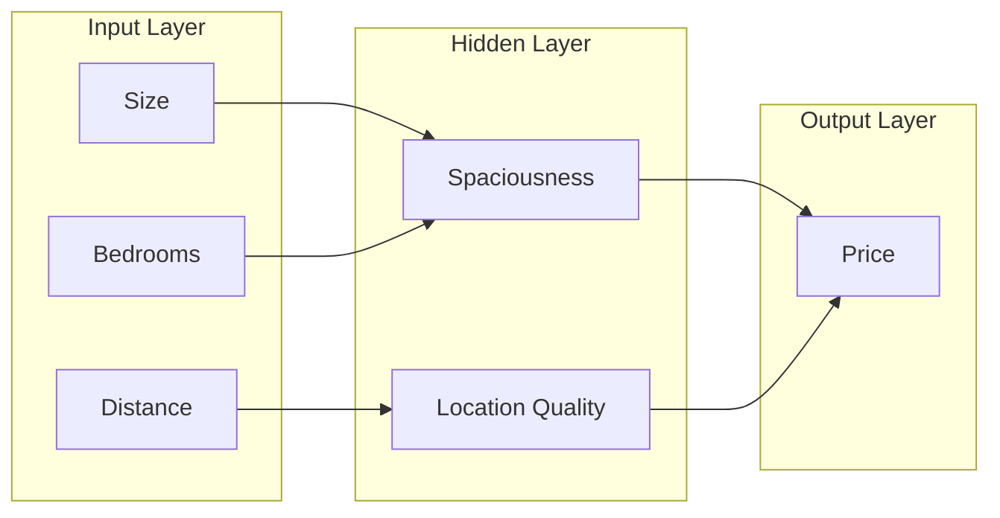

# Feed-Forward Architecture – Artificial Neural Networks (Module 1)

## Learning Objectives

By the end of this video you will:

1. **Define** a feed-forward neural network.
2. **Identify** its core building blocks: weights, bias, and layers.
3. **Recognize** why this architecture forms the foundational structure of modern neural networks.

---

## Prerequisite: From Building Blocks to Architecture

So far we have seen the **basic building blocks** of a neural network: **weights**, **bias**, and **layers**. In this video we **put these pieces together** to form the simplest and most fundamental neural network architecture—the **feed-forward neural network**.

---

## Definition of Feed-Forward

### What “Feed-Forward” Means

The term **feed-forward** simply means that **information flows in only one direction**: from the **input layer** through one or more **hidden layers** and finally to the **output layer**.

- There are **no loops** — information does not cycle back.
- There are **no feedback connections** — no layer sends signals backward.
- There is **no dependence on past outputs** — each computation uses only the current inputs from the previous layer.

This **one-way flow** makes feed-forward networks **easy to understand**, **easy to compute**, and the **foundation of most modern neural network models**.

> **Exam tip:** Feed-forward = strictly one-way flow; no cycles, no recurrence. If you see loops or feedback, it is not a feed-forward network.

---

## Structural View: Stack of Layers and DAG

### Organization as a Stack of Layers

Structurally, a feed-forward neural network is organized as a **stack of layers**. Each layer is connected **only to the next layer** in the sequence.

- **Every neuron** in one layer:
  - Takes **inputs** from the previous layer
  - Applies **weights and bias**
  - Sends its **output forward** to the next layer

There is a **clear start point** at the input layer and a **clear endpoint** at the output layer.

### Directed Acyclic Graph (DAG)

Because of this one-directional flow, the entire network forms a **directed acyclic graph (DAG)**:

- **Directed:** edges have a direction (from one layer to the next).
- **Acyclic:** there are **no cycles**; information never flows back to an earlier layer.

So the computation has a well-defined order and no circular dependencies.

### Layer Roles in the Feed-Forward Flow

| Layer type       | Role in feed-forward flow                                      |
|------------------|----------------------------------------------------------------|
| **Input layer**  | Receives raw features; starting point; no computation, only pass-through. |
| **Hidden layer(s)** | Takes outputs from previous layer; applies weights and bias; produces internal representations. |
| **Output layer** | Takes last hidden layer’s output; produces the final prediction (e.g. a single number). |

---

## Running Example: House Price Prediction

We use the **house price prediction** example to see how the feed-forward flow works step by step.

### Step 1: Input Layer

At the **input layer**, we feed in **raw features**:

- Size of the house
- Number of bedrooms
- Distance from the city center

### Step 2: Hidden Layer(s)

These inputs are passed to the **hidden layer** (or multiple hidden layers), where they are **combined using weights and bias** to form **internal features**, such as:

- **Spaciousness** — derived from size and number of bedrooms
- **Location quality** — derived from distance from city center

### Step 3: Output Layer

The **output layer** takes these internal representations and produces a **single number**—the **predicted house price**.

### Flow Summary

Information flows **step by step**: **raw features → abstract features → final prediction**. At **no point** does information move backward or in a loop.

---

## Why “Feed-Forward”: Dependencies and Pipeline

### Layer Dependencies

This architecture is called **feed-forward** because:

- **Each layer depends only on the output of the previous layer.**
- A neuron **never** depends on its own past output or on the output of any neuron in a **future** layer.

### Computational Pipeline

This creates a **clear computational pipeline**: each layer performs **one stage of transformation** and **hands the result forward**. There is a fixed order of computation with no ambiguity.

---

## Why One-Way Flow Matters

The one-way flow is important for three reasons:

| Benefit | Explanation |
|--------|-------------|
| **Simplifies forward computation** | There are no cycles to resolve; we can compute layer by layer in a single pass. |
| **Avoids circular dependencies** | The order of computation is well-defined; no layer needs to “wait” for a later layer. |
| **Basis for efficient learning** | This structure underlies **efficient learning algorithms** (e.g. backpropagation) that we will study later in the course. |

> **Exam tip:** One-way flow ⇒ simple forward computation, no circular dependencies, and a clean basis for learning algorithms. This is why feed-forward is the default “first” architecture to study.

---

## Depth, Abstraction, and Expressive Power

### Stacking Layers

By **stacking multiple layers**, feed-forward networks can represent **highly complex, non-linear functions** even though **each individual neuron is very simple**.

- Each **additional layer** increases the **depth of computation** and the **level of abstraction** in the learned representation.
- **Hidden layers** enable the network to learn **hierarchical representations**—this is the **source of its expressive power**.

### Key Idea

**Complex behavior emerges from the composition of many simple transformations.** Many small steps (one per layer) combine to model complicated input–output relationships.

### Use Cases

Feed-forward networks are widely used for:

- **Regression tasks** — e.g. house price prediction
- **Classification tasks** — e.g. binary or multi-class labels
- **General feature learning** — learning useful internal representations from data

---

## Summary and Exam-Ready Takeaways

- A **feed-forward neural network** passes information **strictly** from the input layer through hidden layers to the final output layer **in one direction only**.
- It is built using the same **three components** we studied earlier: **weights**, **bias**, and **layers**.
- **Hidden layers** enable the network to learn **hierarchical representations**, which is the source of its expressive power.
- This **feed-forward structure** forms the **core architecture** of most neural networks used in practice today.

**Bridge to next video:** In the next video we move from **structure to application** and see where artificial neural networks are used in real-world systems.

---

## Quick Revision and Exam Checklist

- [ ] **Define** a feed-forward neural network (one direction only; no loops, no feedback, no dependence on past outputs).
- [ ] **Describe** the structure (stack of layers; each layer connected only to the next; DAG with clear start and end).
- [ ] **Name** the core building blocks (weights, bias, layers).
- [ ] **Explain** the house-price flow (raw features → hidden layer internal features → output prediction; no backward or loop).
- [ ] **State** why one-way flow matters (simplifies computation, avoids circular dependencies, basis for efficient learning algorithms).
- [ ] **Explain** why feed-forward is foundational for modern neural networks (core architecture of most practical NNs; enables hierarchical representations and composition of simple transformations).
