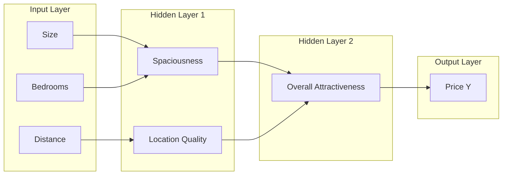

# Weights, Bias & Layers – Artificial Neural Networks (Module 1)

## Learning Objectives

By the end of this video you will:

1. Know **how weights and bias affect the behavior of a neuron**.
2. Understand **how layers form feature hierarchies**.
3. Recognize **how these elements together define what a neural network can represent**.

---

## Prerequisite: Why We Need More Than a Single Neuron

In previous videos we saw that a **single artificial neuron** is only a simple pattern detector and has **very limited expressive power**. To build intelligent systems, we need many neurons working together in an organized way. This organization is achieved using **three fundamental building blocks** of every neural network: **weights**, **bias**, and **layers**. In this note we understand what each of these means conceptually.

---

## Running Example: House Price Prediction

### Task and Goal

Imagine predicting the **price of a house** using a few basic features:

- Size of the house
- Number of bedrooms
- Distance from the city center

This is a **regression problem**: we want to fit a function that maps these features to the output **Y** (the price).

### Visual Structure (Layers and Concepts)

- **Inputs** (often drawn as circles):
  - First input: **size**
  - Second input: **number of bedrooms**
  - Third input: **distance from city center**

- **Intermediate concepts** (hidden layer):
  - **Spaciousness** — derived from size and bedrooms together
  - **Location quality** — derived from distance from city center

- **Output**: **Y** = predicted price

### Layer Mapping

| Layer type    | Contents                                                                 |
|---------------|--------------------------------------------------------------------------|
| **Input layer**  | Size, number of bedrooms, distance from city center                      |
| **Hidden layer(s)** | Spaciousness, location quality (and possibly more abstract concepts)    |
| **Output layer**  | Y (price)                                                                |

### Weights and Bias in This Example

- Different inputs have **different importance** for the price, represented by **weights**:
  - **W1** — importance of size
  - **W2** — importance of number of bedrooms
  - **W3** — importance of distance from city center

- There is also a **base price**: even a very remote, small house has some minimum price. We represent this baseline by the term **B** (**bias**).

This example is used throughout the sections below to illustrate weights, bias, and layers.

---

## Weights

### Definition

Every **connection between neurons** in a neural network has an associated **weight**. Conceptually, a weight represents the **importance or influence** of one input signal on a neuron’s output.

### Interpretation in the House Example

- The weight on **size** tells us how strongly size influences the price.
- **W2** (on number of bedrooms) captures how much each additional bedroom contributes.
- The weight on **distance from city center** typically has a **negative** influence: houses farther away are often cheaper.

So weights tell the network **which features matter more and which matter less**.

### Learning = Adjusting Weights

In neural networks, **learning** simply means **adjusting these weights based on data** so that:

- Important features are **emphasized** (e.g. larger positive or negative weights as needed).
- Less relevant features are **suppressed** (e.g. weights pushed toward zero).

> **Exam tip:** Weights determine feature importance; learning is weight adjustment.

---

## Bias

### Definition

The **bias** term provides a **baseline output** for a neuron. It allows a neuron to produce a meaningful output even when **all input values are small or zero**.

### Interpretation in the House Example

Think of bias as the **base cost** of a house. Even if a house is very small, has few rooms, and is far from the city, it will still have some **minimum price**. That base level is captured by the **bias B**.

### Conceptual Role

- Bias **controls when a neuron begins to activate**.
- It **shifts the response of the neuron left or right**, allowing for greater flexibility in when the neuron “turns on” or contributes to the output.

> **Exam tip:** Bias sets the baseline and controls when the neuron activates.

---

## Layers

### Definition

A **layer** is a group of neurons operating at the **same level** of the network.

### Three Types of Layers

Neural networks are usually organized into:

| Type | Role |
|------|------|
| **Input layer** | Receives the **raw features** (e.g. size, rooms, distance). |
| **Hidden layer(s)** | Compute **intermediate representations** (e.g. spaciousness, location quality). |
| **Output layer** | Produces the **final prediction** (e.g. house price Y). |

### House Price Example

- **Input layer**: Receives basic features — size, rooms, distance.
- **Hidden layers**: Transform these raw numbers into more meaningful internal representations (e.g. spaciousness, location quality).
- **Output layer**: Produces the predicted house price.

### Data Flow

- Each layer **performs a transformation** of the data and **passes the result to the next layer**.
- Information flows **layer by layer** from raw input to the final output.

---

## Hierarchical Representations

### Main Idea

The true power of layers lies in their ability to **build hierarchical representations**: each layer turns low-level information into progressively more abstract concepts.

### House Example, Step by Step

- **First hidden layer**: Learns **intermediate concepts** such as spaciousness or location quality.
- **Next layer**: May combine them into a **more abstract idea**, e.g. overall attractiveness.
- **Final layer**: Turns this abstract notion into a **numerical output** (price).

So each layer converts **low-level raw features** into **progressively more abstract and useful representations**.

### Why This Matters

1. **Complex relationships**: This hierarchy allows neural networks to model highly complex relationships using a **series of simple transformations**.
2. **End-to-end learning**: The system can **automatically discover** useful internal concepts from the data, without hand-designing every intermediate feature.

---

## Summary and Exam-Ready Takeaways

- **Weights** determine how strongly each input feature influences the output.
- **Bias** sets a baseline level and controls when neurons activate.
- **Layers** organize neurons into hierarchical structures that build progressively abstract representations.

Together, **weights**, **bias**, and **layers** define the **structural backbone** of a neural network and determine **what kind of functions it can represent**.

**Bridge to next video:** These building blocks connect to form a **feed-forward neural network**, where information flows from input to output through multiple layers.

---

## Quick Revision and Exam Checklist

- [ ] Define **weight** and explain its role (importance/influence of an input on a neuron’s output).
- [ ] Define **bias** and explain baseline output and when a neuron activates.
- [ ] Name and describe the **three layer types**: input, hidden, output.
- [ ] Explain **hierarchical representations** with an example (e.g. house price: raw features → spaciousness/location → attractiveness → price).
- [ ] State what **“learning”** means in terms of weights (adjusting weights from data to emphasize important features and suppress less relevant ones).
- [ ] Explain how **layers** enable **end-to-end learning** (automatic discovery of useful internal concepts from data).
